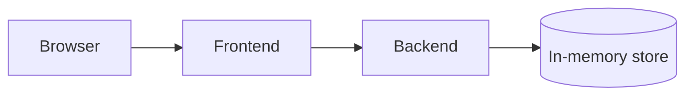

# HLTD — spectra-demo

> Tag: HLTD-1. Reference this in PR descriptions as `Implements: HLTD-1`.

## Components

- **Frontend** (`/frontend`): React + Vite SPA.
- **Backend** (`/backend`): Express + TS. Stateless except for the in-memory store.
- **Store**: in-memory only — fixtures seeded on boot. Acceptable for the demo; never use in production.

## Boundaries

- Frontend never talks to the store directly.
- All cross-component communication is via the documented HTTP API.
- Tokens never leave the Authorization header; never logged.

## Anchors (referenced from PRs)

- `HLTD#auth-flow`: login → token issuance → bearer auth on subsequent calls.
- `HLTD#dashboard-flow`: dashboard reads `/me` once for the header, then `/dashboard/items` for the list.
